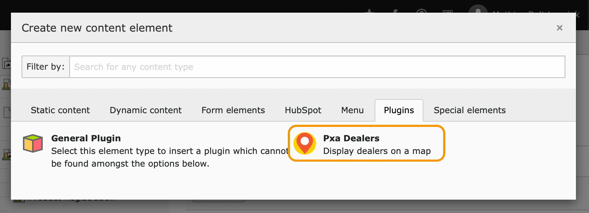

.. include:: ../Includes.txt

.. _installsetup:

======================
Installation and Setup
======================

.. _installsetup-install:

Installation
============

This extension can be installed using Composer.

.. rst-class:: bignums

1. Run `composer require pixelant/pxa-dealers` in the command line to install the
   extension.

2. Activate the extension in the :guilabel:`Admin > Extensions` or by running
   `typo3 extension:activate pxa_dealers`.

3. Include the *Pxa Dealers (pxa_dealers)* static template in the TypoScript
   template for the the site where you would like to use the extension.
   :ref:`More about including static templates <tsref:static-includes>`

.. _installsetup-setup:

Setup
=====

.. _installsetup-setup-registerkeys:

Registering Google API keys
---------------------------

.. _installsetup-setup-registerkeys-two:

JavaScript and server (PHP) keys
~~~~~~~~~~~~~~~~~~~~~~~~~~~~~~~~

For the extension to work properly and avoid misuse of your API keys, you will
have to register *two* keys and assign them to the correct TypoScript
configuration properties:

* :ref:`typoscript-map-javascriptapikey`: A publicly accessible key used in
  JavaScript.
* :ref:`typoscript-map-serverkey`: A secret key used by PHP on the server.

The process to register the keys is the same for both, but each key needs
different access privileges.

.. _installsetup-setup-registerkeys-register:

How to register the API keys
~~~~~~~~~~~~~~~~~~~~~~~~~~~~

.. rst-class:: bignums-xxl

1. Go to the Credentials Console

   Open a web browser and navigate to
   `console.cloud.google.com/apis/credentials <https://console.cloud.google.com/apis/credentials>`__.

   If you are not logged in, you will be asked to log into a Google Account. If
   you have multiple accounts, make sure that you log into the one with the
   billing information you would like to use.

2. Select project

   The link above should bring you to the *Credentials* (1) section of the
   *Google Cloud Platform*'s *APIs & Services* console.

   Ensure that you have selected the correct project from the drop-down menu (2)
   at the top of the page or created a new project.

   Here's how the console looks with some API keys already added (3):

   .. image:: Images/GoogleApiCredentials.png

3. Create new credential

   Click the :guilabel:`Create credentials` button (1) and select
   :guilabel:`API key` (2) from the drop-down menu.

   .. image:: Images/CreateCredentialsMenu.png
      :width: 500px

4. Credentials created

   The new API credentials will be generated immediately and presented to you
   (1). You can copy the credentials right away by clicking the copy button (2).

   .. image:: Images/GoogleApiKeyCreated.png
      :width: 500px

5. Proceed by configuring the key

   Click on the :guilabel:`Restrict key` button (3, above) to enter the
   *Restrict and rename API key* interface.

6. Give the key a name

   Enter a name for the API key (1). We recommend giving a descriptive name,
   e.g. "pxa_dealers googleJavascriptApiKey 2021" and
   "pxa_dealers googleServerApiKey 2021" for the two keys.

   .. image:: Images/RestrictAndRenameApiKey.png
      :width: 500px

   .. warning::

      Please note the warning (2) about the key being unrestricted. Never use an
      unrestricted key for public websites!

7. Configure access restrictions

   Now, we need to restrict access to the key. We do this further down in the
   *Restrict and rename API key* interface. The two keys we are generating need
   different restrictions configured in the :guilabel:`Access restrictions`
   section.

   :ref:`typoscript-map-javascriptapikey`
      This is key is used by JavaScript in the web browser. It must be
      restricted to requests coming from your website. This is called
      *referrer restriction* because it uses the :mailheader:`Referrer` HTTP
      header.

      .. rst-class:: bignums

      1. Select :guilabel:`HTTP referrers (web sites)`.

      2. Click the :guilabel:`Add an item` button.

      3. Enter a domain pattern matching your website's domain. If your web
         site can be found at "https://www.dealersexample.com/", the pattern
         `*.dealersexample.com/*`.

      .. image:: Images/GoogleApiKeyReferrerRestriction.png
         :width: 500px

   :ref:`typoscript-map-serverkey`:
      This key is used by the server (PHP script), so we can restrict it to the
      IP addresses used by the server.

      .. note::

         Many cloud services use different *inbound* and *outbound* IP
         addresses. Make sure you use the outbound IPs.

         * `Platform.sh public IPs list <https://docs.platform.sh/development/public-ips.html>`__

      .. rst-class:: bignums

      1. Select :guilabel:`IP addresses (web servers, cron jobs, etc.)`.

      2. Click the :guilabel:`Add an item` button.

      3. Enter the IP address or IP address range in the :guilabel:`address`
         field.

      Repeat step 2 and 3 until you have added all the necessary IP addresses.

      .. image:: Images/GoogleApiKeyIpRestriction.png
         :width: 500px

   .. info::

      If the restriction setting is wrong, you will see an error message in one
      of two places:

      * **Server-side** restriction errors in the TYPO3 log.
      * **JavaScript** restriction errors in the browser console.

8. Enable APIs

   If this is the first time you are using this project, you'll have to enable
   the necessary APIs from the
   `API library <https://console.cloud.google.com/apis/library>`__. If they are
   already enabled, you can skip to step 9.

   These APIs are:

   * `Geocoding <https://console.cloud.google.com/apis/library/geocoding-backend.googleapis.com>`__
   * `Geolocation <https://console.cloud.google.com/apis/library/geolocation.googleapis.com>`__
   * `Maps JavaScript <https://console.cloud.google.com/apis/library/maps-backend.googleapis.com>`__
   * `Places <https://console.cloud.google.com/apis/library/places-backend.googleapis.com>`__

   .. rst-class:: bignums

   1. From within the Google Cloud Platform, select :guilabel:`Library` (1) from
      the left-hand navigation bar click this link to the
      `API library <https://console.cloud.google.com/apis/library>`__

      .. image:: Images/SelectLibraryFromGoogleCloudPlatform.png
         :width: 500px

   2. Use the search field (1) to search for the APIs.

      .. image:: Images/GoogleApiLibraryHome.png

   3. Click on the correct API in the search result. You will be taken to the
      API's detail page.

   4. Click the :guilabel:`Enable` button to enable the API.

      .. image:: Images/EnableGoogleApi.png

   Repeat steps 2 through 4 until you have enabled all the necessary APIs.

   When you are finished, navigate back to the *Restrict and rename API key*
   interface for the API key you're working on.

9. Select APIs to use

   Within the *Restrict and rename API key* interface, find your way to the
   :guilabel:`API restrictions` section.

   .. rst-class:: bignums

   1. Select :guilabel:`Restrict key`.

   2. Click on the :guilabel:`Select APIs` drop-down menu.

   3. Tick the following checkboxes:

      * Geocoding API
      * Geolocation API
      * Maps JavaScript API
      * Places API

   4. Click the :guilabel:`OK` button.

   5. Click the :guilabel:`Save` button.

   .. image:: Images/SelectGoogleApis.png

.. _installsetup-setup-categories:

Creating Category records
-------------------------

.. rst-class:: bignums-xxl

1. In the TYPO3 Backend, select the :guilabel:`List` module.

2. In the page tree, select the folder where you would like to store your
   categories.

   .. note::

      Categories are fetched from the location specified in the
      :ref:`extensionconfig-categoriesrestriction`.

3. In the DocHeader, click on the :guilabel:`+` (*Create new record*) button.

   .. image:: Images/PageTreeAndCreateRecordButton.png

   The *New record* screen will appear, showing a tree with new record types.

4. In the record tree, click on *Category* (under *System Records*).

   .. image:: Images/SelectCreateCategoryRecord.png
      :width: 500px

   You will now see the *Create new Category* form.

5. Fill in the necessary fields in the *Create new Category* form.

6. Click the :guilabel:`Save` button to save your Category.

Repeat these steps until you have added the Category records you need.

.. _installsetup-setup-dealers:

Creating Dealer records
-----------------------

.. rst-class:: bignums-xxl

1. In the TYPO3 Backend, select the :guilabel:`List` module.

2. In the page tree, select the folder where you would like to store your
   categories.

   .. note::

      Categories are fetched from the location specified in the
      :ref:`extensionconfig-categoriesrestriction`.

3. In the DocHeader, click on the :guilabel:`+` (*Create new record*) button.

   .. image:: Images/PageTreeAndCreateRecordButton.png

   The *New record* screen will appear, showing a tree with new record types.

4. In the record tree, click on *Dealer* (under *Pxa Dealers*).

   .. image:: Images/SelectCreateDealerRecord.png
      :width: 500px

   You will now see the *Create new Dealer* form.

5. Fill in the necessary fields in the *Create new Dealer* form.

   Here's a description of the record's fields apart from those you should know
   from other TYPO3 records.

   **General**

   Name (required)
      The unique name of the Dealer. E.g. "Big Machine Parts, Inc.", "Small
      Stuff (Smalltown)", or "Smalltown Mall". Use the business name if your
      Dealers are single businesses, but add location if your Dealers are parts
      of a chain. If all Dealers are part of the same chain, you can also use
      the location name.

   Logo
      Upload a logo for the Dealer. A well-know logo is easier to spot in a
      list of Dealers.

   **Coordinates**

   Show street view
      When enabled, a Google Street View image of the Dealer's address will be
      displayed in the map marker's information pop-up.

   Country
      Select the country where the Dealer is located.

   Address (required)
      The street address of the Dealer. E.g. "123 Main street"

   City (required)
      The postal city or town where the Dealer is located. E.g. "Smallville"

   Zipcode
      The zip or postal code of the city or town where the Dealer is located.
      E.g. "01234"

   Google maps position
      This Google Map shows the location of the Dealer as it will be displayed
      on the map in the frontend. Click the
      :guilabel:`Update marker position according to chosen country and address fields`
      button to update the marker location when you have added or changed the
      Dealer's address information.

   Latitude
      The latitude of the Dealer's exact coordinates. The value must be entered
      as Decimal Degrees, a decimal number between -90.00 and 90.00, with with
      decimal separator `.`. E.g. "55.600568"

   Longditude
      The longditude of the Dealer's exact coordinates. The value must be
      entered as Decimal Degrees, a decimal number between -90.00 and 90.00,
      with decimal separator `.`. E.g. "12.99902"

   **Additional fields**

   Phone
      The Dealer's phone number. If you display Dealers in multiple countries,
      it is a good idea to include the country code in a standard format, such
      as "+46 123 456 789".

   Link
      For example a link to use for a call-to-action button.

   Website
      A link to the Dealer's website.

   Email
      The Dealer's contact email address.

   Description
      A free-text field that can be used to describe the Dealer in further
      detail or add information that is not covered by the standard fields.

   **Categories**

   Categories
      Select one or more categories that will help the user filter Dealers in
      the frontend.

6. Click the :guilabel:`Save` button to save your Dealer.

Repeat these steps until you have added the Dealer records you need.

.. _installsetup-setup-page:

Creating a page for the listing
-------------------------------

.. tip::

   Some good page names for the Dealers listing are

   * Where to Buy
   * Find Shop
   * Reseller Locator

.. _installsetup-setup-page-plugin:

Adding the plugin to a page
~~~~~~~~~~~~~~~~~~~~~~~~~~~

You can place a Dealers listing on any standard TYPO3 page by going to the
:guilabel:`Page` module and clicking any :guilabel:`+ Content` button.

You can find the plugin content element under the :guilabel:`Plugins` tab. It is
called :guilabel:`Pxa Dealers`.

If you haven't configured a storage page in TypoScript
(:typoscript:`plugin.tx_pxadealers.persistence.storagePid`), make sure to select
a *Record Storage Page*.

.. _installsetup-setup-page-modes:

Plugin modes
~~~~~~~~~~~~

The plugin is split into four *modes* that render different parts of the
functionality. You can add the ones you need to the places where you want them
on the page.

Map
^^^

Displays the Google Map with the dealers listed below. The dealers are also
displayed as markers on the map. For configuration, see
:ref:`typoscript-map`.

Available fields
''''''''''''''''

Order by
   Order of dealers records in the list. See :ref:`typoscript-demand-orderby`.

Order direction
   Order direction for dealer records. See
   :ref:`typoscript-demand-orderdirection`.

Select countries
   Limit the dealers list to these countries. If no countries are selected, the
   countries of the available dealers will be displayed. See also
   :ref:`typoscript-demand-countries`.

Select categories
   Limit the dealers listed to these categories. See also
   :ref:`typoscript-demand-categories`.

Categories menu
^^^^^^^^^^^^^^^

A list of checkboxes allowing users to filter dealers by category.

Available fields
''''''''''''''''

Order by
   Order of dealers records in the list. See :ref:`typoscript-demand-orderby`.

Order direction
   Order direction for dealer records. See
   :ref:`typoscript-demand-orderdirection`.

Select categories
   Limit the dealers listed to these categories. See also
   :ref:`typoscript-demand-categories`.

Countries menu
^^^^^^^^^^^^^^
A drop-down menu allowing users to filter dealers by country. The menu will
automatically display only the countries with available dealers.

Available fields
''''''''''''''''

Select countries
   Limit the dealers list to these countries. If no countries are selected, the
   countries of the available dealers will be displayed. See also
   :ref:`typoscript-demand-countries`.

Search field
^^^^^^^^^^^^
A search field. It will automatically suggest locations from available dealers
in the database and results from Google's Places database. For configuation, see
:ref:`typoscript-search`.

.. warning::

   Zip code search is currently fairly inexact. This is because Google does not
   provide location coordinates based on simply providing a zip code. This means
   zip code search must use a less exact search algorithm. Read more about the
   :ref:`typoscript-search-zipcodeinexactness` TypoScript configuration option.

Available fields
''''''''''''''''

Search result page
   The page to display the search results on.
   See also :ref:`typoscript-search-searchresultpage`.

Search dealers by location in radius
   If enabled, search is limited to results within a radius around the
   geographic coordinates of the location provided by the user. The radius is
   :ref:`defined in TypoScript <typoscript-search-radius>`. See also
   :ref:`typoscript-search-searchinradius`.

Search dealers by location in radius
   When checked, the plugin will try to acquire the user's coordinates through
   the browser. See also :ref:`typoscript-search-searchclosest`.
