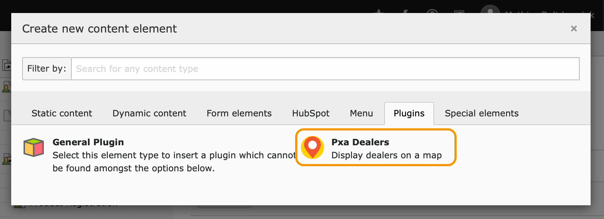

.. include:: ../../Includes.txt

.. _setup-page:

===============
Page and Plugin
===============

.. tip::

   Some good page names for the Dealers listing page are

   * Where to Buy
   * Find Shop
   * Reseller Locator

.. _setup-page-plugin:

Adding the plugin to a page
===========================

You can place a Dealers listing on any standard TYPO3 page by going to the
:guilabel:`Page` module and clicking any :guilabel:`+ Content` button.

You can find the plugin content element under the :guilabel:`Plugins` tab. It is
called :guilabel:`Pxa Dealers`.

If you haven't configured a storage page in TypoScript
(:typoscript:`plugin.tx_pxadealers.persistence.storagePid`), make sure to select
a *Record Storage Page*.

.. _setup-page-modes:

Plugin modes
============

The plugin is split into four *modes* that render different parts of the
functionality. You can add the ones you need to the places where you want them
on the page.

.. _setup-page-modes-map:

Map
---

Displays the Google Map with the dealers listed below. The dealers are also
displayed as markers on the map. For configuration, see
:ref:`typoscript-map`.

Available fields
~~~~~~~~~~~~~~~~

Order by
   Order of dealers records in the list. See :ref:`typoscript-demand-orderby`.

Order direction
   Order direction for dealer records. See
   :ref:`typoscript-demand-orderdirection`.

Select countries
   Limit the dealers list to these countries. If no countries are selected, the
   countries of the available dealers will be displayed. See also
   :ref:`typoscript-demand-countries`.

Select categories
   Limit the dealers listed to these categories. See also
   :ref:`typoscript-demand-categories`.

.. _setup-page-modes-categories:

Categories menu
---------------

A list of checkboxes allowing users to filter dealers by category.

Available fields
~~~~~~~~~~~~~~~~

Order by
   Order of dealers records in the list. See :ref:`typoscript-demand-orderby`.

Order direction
   Order direction for dealer records. See
   :ref:`typoscript-demand-orderdirection`.

Select categories
   Limit the dealers listed to these categories. See also
   :ref:`typoscript-demand-categories`.

.. _setup-page-modes-countries:

Countries menu
--------------

A drop-down menu allowing users to filter dealers by country. The menu will
automatically display only the countries with available dealers.

Available fields
~~~~~~~~~~~~~~~~

Select countries
   Limit the dealers list to these countries. If no countries are selected, the
   countries of the available dealers will be displayed. See also
   :ref:`typoscript-demand-countries`.

.. _setup-page-modes-searchfield:

Search field
------------

A search field. It will automatically suggest locations from available dealers
in the database and results from Google's Places database. For configuation, see
:ref:`typoscript-search`.

.. warning::

   Zip code search is currently fairly inexact. This is because Google does not
   provide location coordinates based on simply providing a zip code. This means
   zip code search must use a less exact search algorithm. Read more about the
   :ref:`typoscript-search-zipcodeinexactness` TypoScript configuration option.

Available fields
~~~~~~~~~~~~~~~~

Search result page
   The page to display the search results on.
   See also :ref:`typoscript-search-searchresultpage`.

Search dealers by location in radius
   If enabled, search is limited to results within a radius around the
   geographic coordinates of the location provided by the user. The radius is
   :ref:`defined in TypoScript <typoscript-search-radius>`. See also
   :ref:`typoscript-search-searchinradius`.

Search dealers by location in radius
   When checked, the plugin will try to acquire the user's coordinates through
   the browser. See also :ref:`typoscript-search-searchclosest`.
